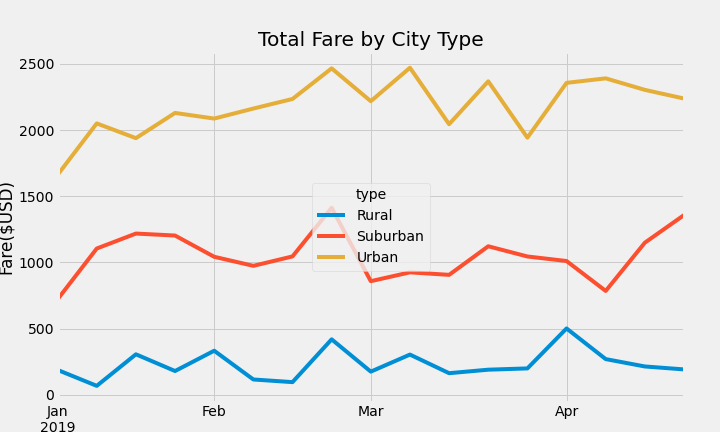

# PyBer_Analysis
Chris Padila
08/23/2020

# Overview 
  The point of the analysis is to create a summary DataFrame of the ride-sharing data by city type. With the new DataFrame, create a multiple line chart to demostrate the total weekly fares for each city type. In order to create this multiple line chart, I used my knowledge in python and pandas to obtain the total number of rides, total number of drivers, average fare per ride, and average fare per driver. Then, using functions such as pivot and resample to arange the DataFrame to create the mutiple line matplotlib chart. 
  
# Results 
## Summary DataFrame
  To create a mutiple-line chart, the data obtained from the city_data.csv and ride_data.csv files had to be merged together and recalculated to form a new DataFrame. The calulations needed in this DataFram included, using the groupby(), count() and sum() functions to find the total number of rides, drivers and fares. From these calculations, I could calculate the average fare per ride and driver. Once all of the calculations are done, they are united together under a summarized DataFrame that is cleaned up and reformated to illustrate each calculation by city type.
  

## Multiple-line Chart
  To ensure that the chart displays the correct output. First, a new DataFrame had been created while using the groupby() function on the original DataFrame (pyber_data_df) to find the sum of all fares for city type and date. From there, the DataFrame index can be reseted in order to create a pivot table. The pivot table is then organized to show that our index is equal to the date, the columns are equal to city type and the values are equal to the fares per city type. From the pivot table, a new DataFrame is created to display dates from 2019-01-10 to 2019-04-29 and is set to a datetime datatype. Another DataFrame has to be created from our previous DataFrame to display the sum of fares for each week while using the resample() function again. Finally, we can use the resamples DataFrame to create the multiple-line chart that illustrates the total fare per city type. 
  
  
  
   From the chart, we can see that each city type has spike of total fares between the months of Feburary and March but only Urban areas continue to see spikes of total fares in the month of March. Whereas, in Suburban areas the total fares remains slighty constant around 1,000 total fares and the Rural areas see another big spike of total fares by the end of the month. 

# Summary
  While it is no surprise that Urban areas experience the highest total number of fares throughout the given months. There are a couple of recommendations that could be made to the CEO to address the disparities among city types. First, the average fare per ride in Urban areas can be increased to match the average of Suburban and Rural areas. Allocting more divers to Urban areas would benefitcial because most rides come from urban areas. Finally, PyBer could decrease the number of drivers of Rural areas and increase the average fare per driver due to the total number of trips in rural areas. 
